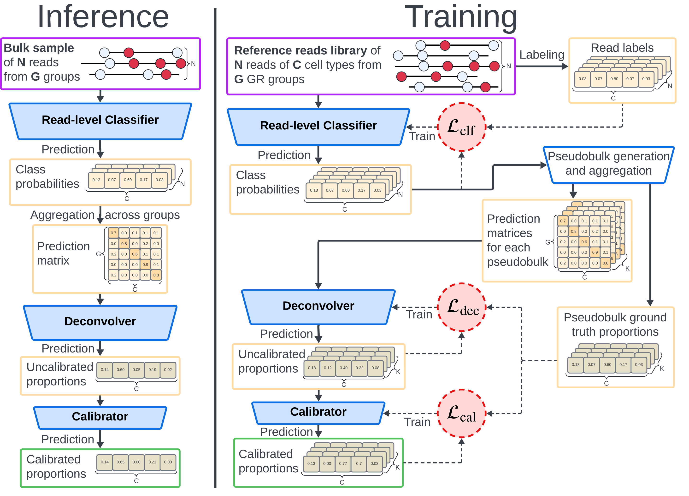

# Syto

  

Repository for sequence-based, read-level combined DNA-methylome classification and deconvolution 
of cell types using Deep Learning models.

## Main Features

- **Genomic sequences libraries labeling**, including *data-driven soft labeling* scheme which 
allows to faithfully represent many-to-many relationship between epigenetic patterns and 
associated cell types. 
- **Read-level classifiers training** for connecting individual reads epigenetic signatures with 
associated cell types.
- **Pseudobulk generation** for creating in-silico mixtures of the classification enriched reads
for deconvolution fitting and evaluation purposes. 
- **Deconvolution fitting** for training deconvolvers using aggregated probability-simplex matrices
as features.
- **Calibration fitting** for (an optional) additional calibration that can be applied after 
deconvolution step. 
- **Deconvolution Inference** for running fitted *Syto* components to deconvolute target 
sequencing library. 

For the full list of the corresponding commands, see [CLI reference](syto/app/Readme.md)




### Supported Classifiers
| Name | Notes |
| --- | --- |
| `dismir` | Syto extension of original CNN+LSTM Classifier [DISMIR](https://github.com/XWangLabTHU/DISMIR); It has two flavors `minigru` and `lstm` with `lstm` as default |
| `methylbert` | Syto refactor of  [MethylBERT](https://github.com/CompEpigen/methylbert); `max_sequence_length` ≤ 510 |
| `cancer_detector` |Syto implementation and extension of the [CancerDetector](https://academic.oup.com/nar/article/46/15/e89/5036349)|
| `lookup` | Syto introduced 1NN Reference Lookup Classifier |
| `epigenbert2` | Syto extension of [DNABERT-2](https://github.com/MAGICS-LAB/DNABERT_2) foundational model to support epigentic input; **in development** |

### Supported Deconvolvers
| Name | Notes | 
| --- | --- | 
| `xgb` | XGBoost multi-output regressor trained on the aggregated probability-simplex features against pseudobulk proportions
| `swn` | Shallow Wide Network: single 1024-unit hidden layer (GELU, dropout 0.2) with softmax output; 
| `mlp` | 3-layer perceptron (512 → 256 → n_features, GELU + dropout) with softmax output. 
| `nnls` | Non-Negative Least Squares against the reference prediction matrix built from pure per-cell-type profiles (`scipy.optimize.nnls`) 
| `psls` | Probability Simplex Least Squares: NNLS with an additional sum-to-one constraint, solved with `cvxpy` (default) or projected gradient descent (`solver_type: pgd`).

### Supported Calibrators
| Name | Notes |
| --- | --- |
| `linear_clip_normalize` | Per-cell-type linear regression of predicted on true proportions; calibrated values are clipped at 0 and renormalized to sum to 1. |
| `linear_simplex_projection` | Same fitted per-cell-type linear model, but the calibrated vector is projected onto the probability simplex ([Duchi et al., 2008](https://ai.stanford.edu/~jduchi/projects/jd_ss_ys_l1.pdf)).  |
| `vector_scaling` | Multi-class extension of Platt scaling, implemented as in [Kull et al., 2019](https://proceedings.neurips.cc/paper/2019/hash/8ca01ea920679a0fe3728441494041b9-Abstract.html).


## Installation

Syto is packaged with [Poetry](https://python-poetry.org/): the dependency set,
the `syto` console script and the build backend are all declared in
`pyproject.toml`, and `poetry.lock` pins the exact versions every environment
gets. You need Python 3.11+, Poetry 2.x and [Git LFS](https://git-lfs.com/).

Inference runs on CPU, GPU-trained checkpoints included — models are loaded
onto whichever device the machine has. A CUDA 12.8 GPU is still strongly
recommended: the transformer read classifiers (MethylBERT, EpigenBERT2) are
impractically slow without one and say so in the log when they start on CPU.
Training is GPU-only in practice.

Install Poetry first if you do not have it:

```shell
curl -sSL https://install.python-poetry.org | python3 -
# or, if you use pipx:  pipx install poetry
poetry --version
```

Then clone and install:

```shell
git clone https://github.com/CompEpigen/methyldl.git syto
cd syto

# the bundled foundation models (MethylBERT, DNABERT-2) are stored with Git LFS
git lfs install
git lfs pull

poetry install
poetry run syto --help
```

`poetry install` puts the `syto` command in the project virtualenv. 
Activate the environment once:

```shell
eval "$(poetry env activate)"
syto --help
```

## Quick-start

[`quickstart.sh`](quickstart.sh) downloads one published model run and the data it
needs from the [Syto deposit on Hugging Face](https://huggingface.co/datasets/CompEpigen/syto.1.0),
writes an inference config for one RRBS sample, and deconvolutes it:

```shell
./quickstart.sh
```

It first asks you to log into Hugging Face and then fetches about 5 GB into
`./syto-data` and proceeds with inference of a single example sample. You may override the location with `SYTO_DATA_ROOT=/path/to/data ./quickstart.sh`.


Once done, the users may 

## Inference on your own data

Custom inference config can be either obtained by modifying example from the quick-start or
by using config wizzard (see [CLI reference](syto/app/Readme.md))
To start from your own BAM instead of recovered reads, set `input.type: bam`,
`input.data_path` to the BAM, and add `input.reference_path` (WGBS) or
`input.data_type: ont`. 

The hg38 and hg19 references needed to parse BAMs can additionally be downloaded
from the [Syto deposit on Hugging Face](https://huggingface.co/datasets/CompEpigen/syto.1.0).

```shell
GENOME=hg38   # or hg19
ARCHIVE="tier4-source-data/reference-genomes/SYTO_tier4_sourcedata_referencegenomes_${GENOME}_v1.zip"

hf download CompEpigen/syto.1.0 "$ARCHIVE" --repo-type dataset --local-dir syto-data/.archives
unzip -qo "syto-data/.archives/$ARCHIVE" -d syto-data
```

Point `input.reference_path` at the unpacked genome, i.e.
`tier4-source-data/reference-genomes/$GENOME/$GENOME.fa.gz` relative to `syto-data`.

## Citation

Whenever using Syto, please cite: 

- Rizdvanetskyi, Dmytro, Nathan Roos, and Pavlo Lutsik. "Data-Driven Soft Labeling Scales DNA Read Classification to Whole-Body Cell-Type Deconvolution." arXiv preprint arXiv:2607.04987 (2026).

Additionaly, please cite corresponding papers when relevant, depending on a choice of the underlying read classifier: 

- **CancerDetector**: Li, Wenyuan, et al. "CancerDetector: ultrasensitive and non-invasive cancer detection at the resolution of individual reads using cell-free DNA methylation sequencing data." Nucleic acids research 46.15 (2018): e89-e89.

- **Dismir**: LI, Jiaqi, et al. Dismir: Deep learning-based noninvasive cancer detection by integrating dna sequence and methylation information of individual cell-free dna reads. Briefings in bioinformatics, 2021, 22.6: bbab250.

- **MethylBERT**: JEONG, Yunhee, et al. MethylBERT enables read-level DNA methylation pattern identification and tumour deconvolution using a Transformer-based model. Nature Communications, 2025, 16.1: 788.

If you are using our implementation of the baseline methods, cite them accordingly:

- **UXM**: Loyfer, Netanel, et al. "A DNA methylation atlas of normal human cell types." Nature 613.7943 (2023): 355-364. 
- **EpiDISH**: Teschendorff, Andrew E., et al. "A comparison of reference-based algorithms for correcting cell-type heterogeneity in Epigenome-Wide Association Studies." BMC bioinformatics 18.1 (2017): 105.
- **Houseman CP**: Houseman, Eugene Andres, et al. "DNA methylation arrays as surrogate measures of cell mixture distribution." BMC bioinformatics 13.1 (2012): 86.
- **CelFiE**: Caggiano, Christa, et al. "Comprehensive cell type decomposition of circulating cell-free DNA with CelFiE." Nature communications 12.1 (2021): 2717.


